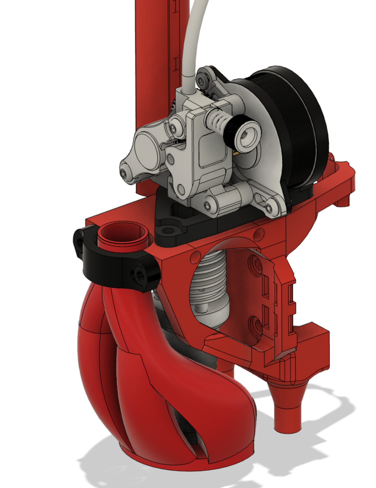

# Goliath & beacon toolhead for MGN12

This toolhead is for the Goliath hotend while using Beacon3D on a MGN12. I am using a Hextrudort as extruder and have a mating adapter plate. One can easily create another adapter without the need, to change anything else. 

This toolhead is using CPAP. 

